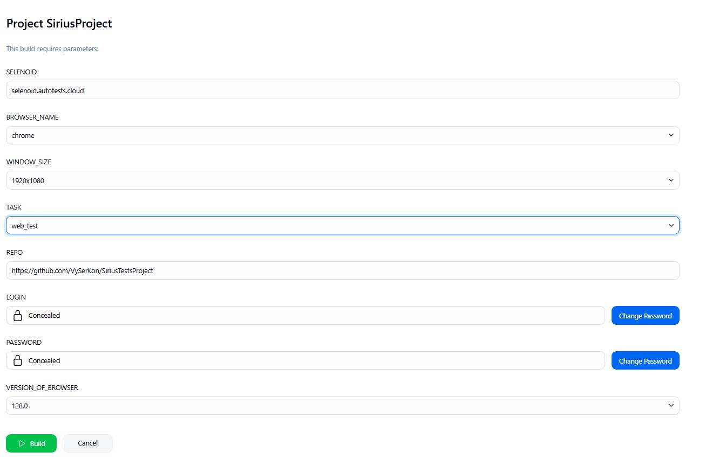

# Проект автоматизации тестирования магазина музыкальных инструментов [SIRIUS](https://siriusmusic.ru/)


## Содержание:

- [Технологии и инструменты](#Технологии-и-инструменты)
- [Выполняемые проверки](#Выполняемые-проверки)
- [Запуск в Jenkins](#Запуск-в-Jenkins)
- [Allure отчёт](#Allure-отчёт)
- [Видео с примером запуска тестов в Selenoid](#video)
 

## <a name="Технологии и инструменты">Технологии и инструменты</a>
<p  align="center">
  <code></code>
  <code></code>
  <code></code>
  <code></code>
  <code></code>
  <code></code>
  <code></code>
  <code></code>
 </p>

- `JUnit 5` служит основным фреймворком для написания и запуска тестов.
- Для UI-автотестов используем связку `Java` + `Selenide` — это дает нам лаконичный и стабильный код.
- `Gradle` отвечает за сборку проекта и управление зависимостями.
- `Jenkins` автоматически запускает тесты в `Selenoid` — это быстрые и изолированные запуски.
- После прогона `Allure Report` формирует детальную визуализацию результатов.


## <a name="Выполняемые проверки">Выполняемые проверки</a> 
Проект включает в себя несколько модульных блоков автоматизированных UI-тестов:

:heavy_check_mark:Проверки корзины</br>
:heavy_check_mark:Проверки главного меню</br>
:heavy_check_mark:Проверки фильтрации каталога</br>
:heavy_check_mark:Проверки поиска</br>
:heavy_check_mark:Проверки работы каталога</br>

Реализован подход Page Object а также параметризация


## Запуск тестов в [Jenkins](https://jenkins.autotests.cloud/job/SiriusProject/)
Локально каждая группа тестов запускается командой ```gradle clean <Tag>``` , где ```<Tag>``` - это:
- web_test
- cart_test
- catalog_test
- filter_test
- menu_test
- search_test

Для подобного гибкого запуска тестов в `Jenkins` была реализована параметризованная сборка с возможностью выбора той или иной группы тестов через Choice Parameter = TASK , а также возможность выбора других параметров:
```
clean
${TASK}
-Dselenoid=${SELENOID}
-DbrowserName=${BROWSER_NAME}
-DwindowSize=${WINDOW_SIZE}
-DbrowserVersion=${VERSION_OF_BROWSER}
-Dlogin=${LOGIN}
-Dpassword=${PASSWORD}
```


 


 
